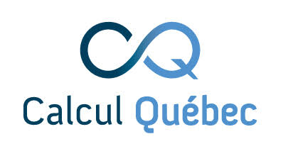

Some tutorials require you to run computations on a **high-performance computing
(HPC) cluster**. For this course we use a dedicated
[Magic Castle](https://www.alliancecan.ca/en/services/research-software/magic-castle)
instance — a temporary cluster, built by Calcul Québec, that reproduces the
Digital Research Alliance of Canada (DRAC) environment: the **Slurm** scheduler,
software **modules**, and a **JupyterHub** web portal. It is allocated **only for
this class**, so the skills you learn here carry over directly to the national
clusters.

::: {.callout-important}
## Register first
Go to **<https://mech501.calculquebec.cloud/>** and create your account before
the first cluster task — see [Registration](registration.qmd).
:::

::: {.callout-warning}
## The cluster is temporary
The instance — and everything stored on it — is **deleted at the end of the
course**. Always download any results you want to keep.
:::

::: {.callout-note}
## A brand-new setup — expect the odd hiccup
This is the **first time** we run the course on this cluster, so you may hit the
occasional glitch. If something doesn't work as described here, please post on
the discussion board and we'll fix it quickly — thanks for your patience!
:::

## On this page

- [Registration](registration.qmd) — create your account and log in.
- [Intro](intro.qmd) — how the cluster is organised (login vs. compute nodes, storage, modules).
- [JupyterLab](jupyterlab.qmd) — the main way you will work: notebooks in the browser.
- [VS Code](vscode.qmd) — an alternative editor (notebooks, Python, and LaTeX) in the browser.
- [Terminal and vim](terminal.qmd) — the JupyterLab terminal, basic commands, vim, and (later) SSH access.

## Acknowledgements

The computing resources for this course are generously provided by the
[Digital Research Alliance of Canada](https://alliancecan.ca) (formerly Compute
Canada) and its regional partner [Calcul Québec](https://www.calculquebec.ca),
through their [Magic Castle](https://www.alliancecan.ca/en/services/research-software/magic-castle)
platform. We gratefully acknowledge their support in providing the training
cluster used in these tutorials.

::: {layout-ncol=2 style="align-items:center; max-width:520px; margin-top:1rem; gap:2rem;"}
[{fig-alt="Digital Research Alliance of Canada / Alliance de recherche numérique du Canada" width="260px"}](https://alliancecan.ca)

[{fig-alt="Calcul Québec" width="150px"}](https://www.calculquebec.ca)
:::
