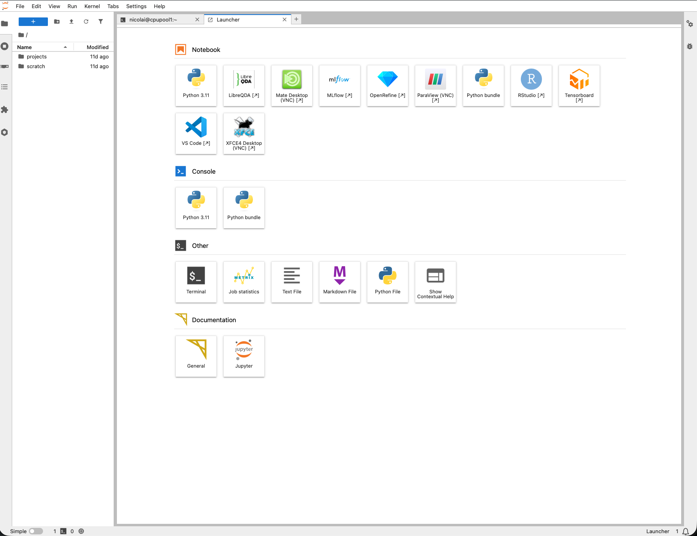

For this course the main way to work on the cluster is **JupyterLab**, served
through the cluster's JupyterHub portal. It gives you notebooks, a file browser,
and a terminal running on a **compute node** — no SSH required.

## Launch a session

1. Go to **<https://mech501.calculquebec.cloud/>** and log in with your cluster
   account (see [Registration](registration.qmd) for the first-time walkthrough).
2. On the **Server Options** page, choose the resources for your session — the
   defaults are fine for this course:
   - **Account** — the allocation to charge; leave the pre-filled value
     (e.g. `def-sponsor00`) unless told otherwise.
   - **Time (hours)** — how long the session lives; a few hours is plenty.
   - **Number of cores** and **Memory (MB)** — 1 core and ~8192 MB (8 GB) are
     enough for the Python post-processing tasks.
   - **GPU configuration** — leave at **None** unless a task says otherwise.
   - **User interface** — keep **JupyterLab**.
3. Click **Start**. Your session is queued and then opens on a compute node.

## Working in Python

When JupyterLab opens, the file browser on the left shows two folders,
`projects` and `scratch`.

::: {.callout-important}
## Keep your work in `scratch`
Do all your course work **inside the `scratch` directory** — create your
notebooks and scripts there, and read and write your data there. Double-click
`scratch` in the file browser to enter it before you start. (`scratch` is the
large working space; your home and `projects` folders are not meant for active
run data. Remember it is temporary — download anything you want to keep, see
[Intro](intro.qmd).)
:::

{#fig-jlab-home width="95%"}

### Start a Python notebook

Open the **Launcher** (the blue **+** button at the top-left of the file
browser, if it isn't already open). Under **Notebook**, click the
**Python 3.11** tile — the blue-and-yellow **Python symbol**. This starts a
Python instance (a kernel) and opens a new notebook.

{#fig-launcher width="95%"}

### Write and run your code

Type Python into a cell and press **Shift + Enter** to run it. The notebook keeps
your code, its output, and any plots together in one document — ideal for the
post-processing tasks. Keep the notebook saved inside **`scratch`** (check the
path in the breadcrumb above the file browser).

{#fig-plotting width="95%"}

::: {.callout-warning}
## Save your work
The session ends when its time limit is reached. Save notebooks often and
**download any results** you want to keep (right-click ▸ Download) — remember the
whole cluster is temporary.
:::

::: {.callout-tip collapse="true"}
## Using your own Python packages
Open a terminal in JupyterLab and build a virtual environment, then register it
as a Jupyter kernel so it appears in the launcher:

```bash
module load python/3.11
virtualenv --no-download ~/mech501
source ~/mech501/bin/activate
pip install --no-index numpy matplotlib scipy ipykernel
python -m ipykernel install --user --name mech501 --display-name "MECH 501"
```
:::
