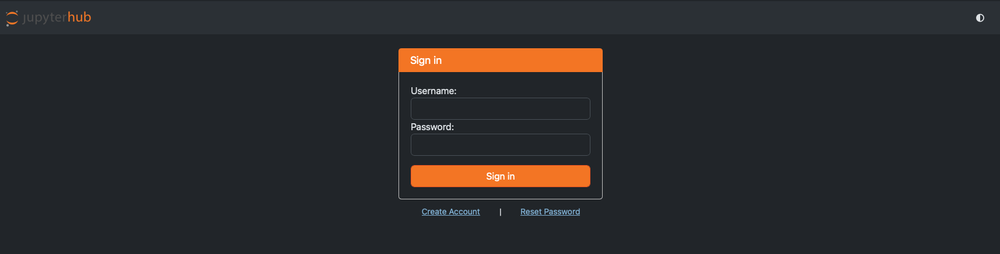
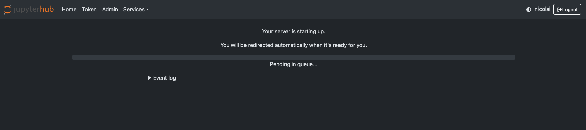

Our Magic Castle instance has its **own accounts** — you do **not** need a
Digital Research Alliance (CCDB) account or a national allocation to use it. You
register directly on the cluster's web portal.

::: {.content-visible when-profile="solutions"}
::: {.callout-warning}
## Instructor TODO (solutions build only)
Confirm the registration flow for this instance and fill in below:

- Is a **sign-up / registration code** required? If so, post it on myCourses.
- Confirm the **Account** value shown on the Server Options page (e.g. `def-sponsor00`).
- Confirm the **SSH login host** used on the [Terminal and vim](terminal.qmd) page.
:::
:::

## Create your account

1. Open the course cluster portal: **<https://mech501.calculquebec.cloud/>**.
2. On the sign-in page, click **Create Account** (see @fig-login).
3. Choose a **username** and **password** (enter the registration code from
   myCourses if you are prompted for one), then submit.
4. Return to the sign-in page and **log in** with your new credentials.
   Forgot your password later? Use **Reset Password** on the same page.

::: {.callout-tip}
Pick a password you don't use elsewhere — this is a temporary training account —
and register **early**, so any issues are sorted out before the task is due.
:::

## Starting the instance for the first time

After you log in, JupyterHub asks what kind of session you want and then starts
it for you on a compute node. The first run looks like this.

{#fig-login width="95%"}

 page) — then click **Start**.](Figures/JLabSetup.png){#fig-server-options width="95%"}

{#fig-server-spawn width="95%"}

Once JupyterLab opens, you are ready to work — continue with
[JupyterLab](jupyterlab.qmd).
