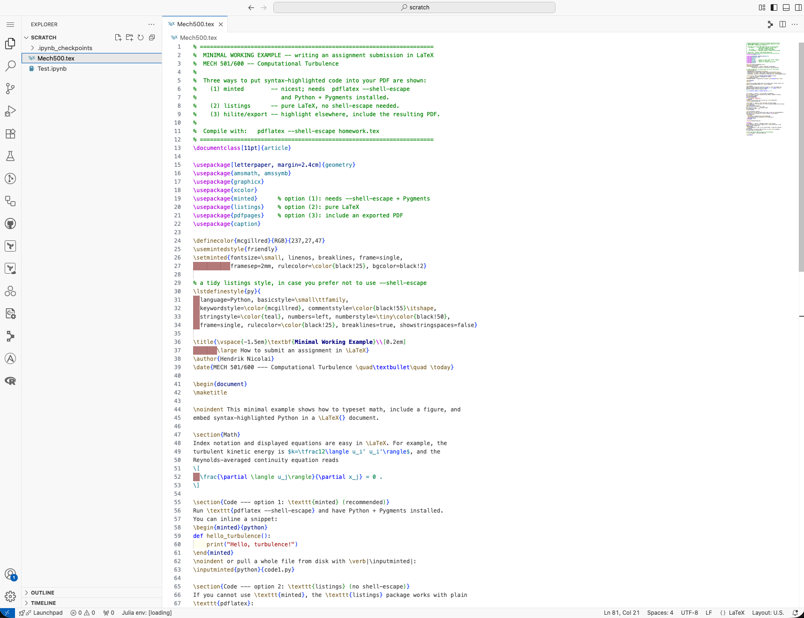

If you prefer **VS Code** to the JupyterLab interface, the cluster provides it in
the browser (code-server) — nothing to install locally. It runs on the same
compute node as your session and can edit and run Jupyter notebooks, Python
scripts, and LaTeX.

## Open VS Code

1. Start a session and open the **Launcher** (see [JupyterLab](jupyterlab.qmd)).
2. Under **Notebook**, click the **VS Code** tile. VS Code opens in a new browser
   tab, running on the cluster.
3. In VS Code, open your working folder with **File ▸ Open Folder…** and select
   **`scratch`**, so the Explorer is rooted there. Keep all your work in
   `scratch` (see [Intro](intro.qmd)).

## One-time setup: make your settings writable

On this shared image VS Code's `settings.json` is a **symlink to a read-only
file**, so VS Code cannot save your preferences and shows a *read-only* warning.
Run this **once** in a terminal (JupyterLab **File ▸ New ▸ Terminal**) to replace
the link with a writable copy --- after that VS Code configures normally:

```bash
cp --remove-destination $(readlink $HOME/.local/share/code-server/User/settings.json) $HOME/.local/share/code-server/User/settings.json
```

## Notebooks and Python

Open a `.ipynb` notebook (or a `.py` file) from the Explorer. The first time you
run a cell, click **Select Kernel** (top-right) and choose **Python 3.11**. Then
run cells as usual — output and plots appear inline, just as in JupyterLab.

{#fig-vscode-python width="95%"}

## LaTeX

You can also edit LaTeX in the same VS Code window — handy for writing up your
Crowdmark submission next to your code.

{#fig-vscode-tex width="95%"}

::: {.callout-note}
## Harmless warnings
You may see a prompt to install a language extension (e.g. Julia) --- dismiss it;
it does not affect your Python or LaTeX work. (The read-only `settings.json` pop-up
is resolved by the one-time step above.)
:::


## Advanced: connect from your own VS Code over SSH

The browser VS Code above needs nothing installed. If you would rather use a **VS
Code installed on your own computer**, its **Remote - SSH** extension opens a window
that runs *on the cluster* --- your local editor, but the cluster's files, terminals
and Python.

1. In your local VS Code, install the **Remote - SSH** extension (from Microsoft).
2. Make sure you can already `ssh` to the cluster first --- set that up in the SSH
   section of the [Terminal and vim](terminal.qmd#ssh-advanced) page (an
   `~/.ssh/config` entry such as `turb` makes this a one-click connection).
3. Open the Command Palette (**Ctrl/Cmd + Shift + P**), run
   **Remote-SSH: Connect to Host…**, and pick your host (e.g. `turb`) or type
   `<username>@mech501.calculquebec.cloud`.
4. A new window opens connected to the cluster. Use **File ▸ Open Folder…** to open
   your `scratch` directory and work exactly as in the browser version.

::: {.callout-important}
Extensions in Remote - SSH are installed **per host**. The first time you connect,
you must install the **Python** and **Jupyter** extensions *again* in the remote
window (VS Code prompts you, or use the Extensions panel and click
**Install in SSH: …**) --- only then do notebooks and kernels work on the cluster.
:::

Full walkthrough and troubleshooting: Microsoft's
[Remote Development using SSH](https://code.visualstudio.com/docs/remote/ssh) guide.
