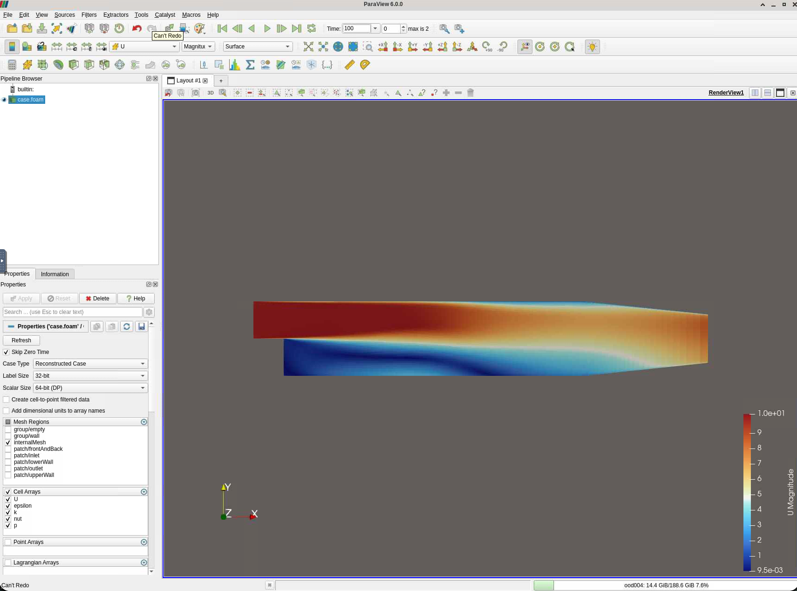
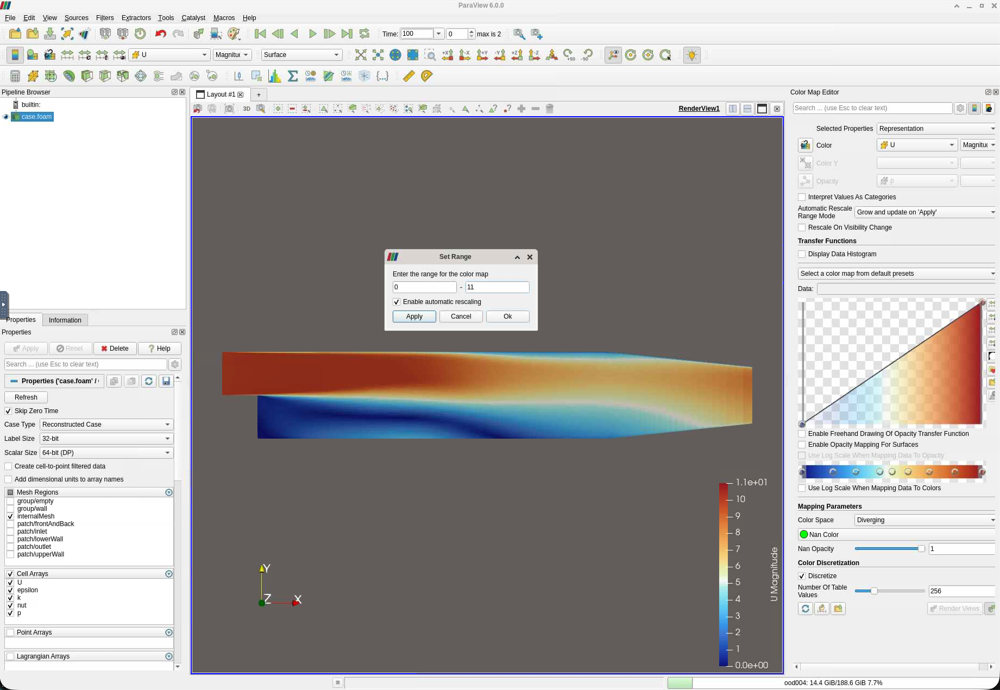
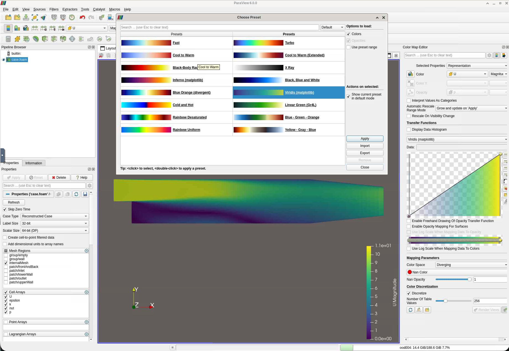

ParaView is an open-source, cross-platform visualisation application designed
for large-scale scientific datasets. It can handle the full range of OpenFOAM
output — structured and unstructured meshes, time series, and multi-processor
reconstructed fields — and provides an interactive 3-D render view alongside
quantitative analysis tools such as line plots, surface integrals, and data
export. For HPC workflows it can also render server-side: on the course cluster you open
it inside a **remote desktop served through JupyterLab**, so the heavy rendering
happens on the compute node and you interact with it in your browser.

This tutorial walks through the most important ParaView features using the
pitzDaily backward-facing step case as a concrete example. By the end you will
be able to visualise velocity and pressure fields, extract profiles, add
streamlines, and export publication-ready images.

All steps assume you are working on the course cluster through JupyterLab
(<https://mech501.calculquebec.cloud/>). If you have not set that up yet, see the
[Cluster](../cluster/index.qmd) and [JupyterLab](../cluster/jupyterlab.qmd) pages.

---

## Open the case

1. In the JupyterLab **Launcher**, open the **Desktop** (VNC) tile, then
   double-click the **Paraview** icon to start ParaView.
2. In ParaView, go to **File → Open**.
3. Navigate to your case directory under scratch, e.g.
   ```
   /scratch/$USER/pitzDaily/
   ```
4. Select the trigger file `pitzDaily.foam` (create it first from a terminal if it
   does not exist: `touch pitzDaily.foam`). The name doesn't matter as long as it
   ends with `.foam`.
5. Click **OK**, then click **Apply** in the Properties panel on the left.

ParaView reads all time directories at once. You should see the geometry appear
in the render view — a long rectangular channel with a small step on the left.

> **Nothing visible?** Make sure **Wireframe** or **Surface** is selected in the
> toolbar representation dropdown (not **Points**), and press **R** to reset the
> camera to fit the geometry.

---

## Select a field to display

At the top of the render window there are two dropdowns side by side:

```
[ U ▾ ]   [ Magnitude ▾ ]
```

- The **left dropdown** selects the field: `U` (velocity), `p` (pressure), `k`
  (turbulent kinetic energy), `epsilon`, etc.
- The **right dropdown** selects the component: `Magnitude`, `X`, `Y`, or `Z`.

For a first look, set it to **U → Magnitude**. The channel will be coloured by
flow speed, with blue at rest and red at peak velocity.

{width="90%"}

### Rescale the colour map

The automatic range may include boundary artefacts. Click the
**Rescale to Data Range** button (the double-arrow icon in the colour bar, or
**View → Color Map Editor → Rescale**) to fit the colour range to the actual
field values.

{width="90%"}

To change the colour map go to **View → Color Map Editor**, click
**Choose Preset** (the grid icon), and select a map. **Cool to Warm** and
**Viridis** are good choices for velocity; avoid rainbow maps for published work.

{width="90%"}

---

## Explore the geometry with Clip and Slice

### Slice — view a 2-D cross-section

1. With the `.foam` reader selected in the Pipeline Browser, go to
   **Filters → Search** (or press `/`) and type `Slice`.
2. In the Properties panel set the **Normal** to `(0, 0, 1)` (the z-axis) and
   **Origin** to `(0, 0, 0)` — the midplane of the 2-D domain.
3. Click **Apply**.

You now have a flat 2-D view of the velocity field across the channel — this is
the canonical way to inspect pitzDaily results. Note, that the simulation was already 2-D.
Therefore, you should see essentially the same picture.

### Clip — remove half the domain

1. Apply **Filters → Clip** to the reader.
2. Set the plane normal to `(0, 1, 0)` (y-axis) and adjust the origin to cut
   through the step height.
3. Click **Apply**.

Use Clip to reveal interior structure in 3-D cases. For pitzDaily (which is
essentially 2-D), you remove basically half the domain.

---

## Velocity vectors

Vectors help you see flow direction, not just magnitude.

1. Select the `.foam` reader (or the Slice filter) in the Pipeline Browser.
2. Go to **Filters → Alphabetical → Glyph** (or search for `Glyph`).
3. In Properties:
   - **Glyph Type**: Arrow
   - **Orientation Array**: U
   - **Scale Array**: U, **Scale Factor**: adjust until arrows are legible
     (start with `0.005`)
   - **Glyph Mode**: Every Nth Point — set N to something like `5` to avoid
     overcrowding
4. Click **Apply**.

The recirculation zone behind the step should now be clearly visible as arrows
pointing upstream near the bottom wall. (hide the `.foam` to see this better)

---

## Streamlines

Streamlines trace the path a massless particle would follow in the velocity field.

1. Select the `.foam` reader in the Pipeline Browser.
2. **Filters → Search → Stream Tracer**.
3. In Properties:
   - **Vectors**: U
   - **Integrator Type**: Runge-Kutta 4-5
   - **Seed Type**: High Resolution Line Source
     - Set the line from `(0, 0, 0.0005)` to `(0, 0.025, 0.005)` — a vertical seed
       line just downstream of the step
   - **Max Streamline Length**: 3 (metres — adjust to your domain size)
4. Click **Apply**.

Colour the streamlines by **U Magnitude** to show speed along the path. You
should see streamlines curling around the recirculation bubble behind the step.

---

## Plot a velocity profile over a line

This extracts quantitative data — e.g. the U-velocity profile at a given
x-station — which you can compare against reference data or analytical solutions.

1. Select the `.foam` reader.
2. **Filters → Search → Plot Over Line**.
3. Set the line endpoints to sample a vertical profile at, say, x = 0.1 m:
   - **Point 1**: `(0.1, -0.02, 0.05)`
   - **Point 2**: `(0.1,  0.05, 0.05)`
4. Click **Apply**.

A new **Line Chart View** opens automatically. To show only U_X:

- In the Properties panel under **Series Parameters**, uncheck everything except
  `U_X`.

### Export the data

Right-click anywhere in the chart and choose **Export Scene** (or go to
**File → Export Scene**) to save the profile as a CSV for further analysis in
Python or MATLAB.

---

## Pressure field

Switch the display field to **p** to inspect the pressure distribution.

Key things to look for in pitzDaily:

- A high-pressure stagnation region on the front face of the step.
- A low-pressure core in the recirculation zone immediately behind the step.
- Pressure recovering toward the outlet as the flow reattaches.

Pressure is stored as *kinematic* pressure (p/ρ, units m² s⁻²) in incompressible
OpenFOAM cases — multiply by the fluid density if you need Pascals.

---

## Annotate and adjust the view for export

### Camera controls

| Action | Mouse / Keyboard |
|---|---|
| Rotate | Left-click drag |
| Pan | Middle-click drag (or Shift + left drag) |
| Zoom | Scroll wheel |
| Reset camera | **R** |
| Set to +X / +Y / +Z view | **Numpad 1 / 2 / 3** (if available) |

For the pitzDaily 2-D case, lock to the XY plane with **View → Standard Views → +Z**.

### Add a colour bar and title

- **View → Show Color Bar** (if not already visible).
- Double-click the colour bar label to edit the title (e.g. change `U_Magnitude`
  to `Velocity magnitude (m/s)`).
- **View → Annotation** → Add a **Text** annotation for figure titles or labels.

### Save a screenshot

**File → Save Screenshot**:
- Set resolution to at least **1920 × 1080** for reports (or 300 dpi equivalent
  for journal figures).
- Format: PNG for lossless, JPEG for smaller file size.

---

## Quick reference — most-used filters for CFD

| Filter | What it does | Where to find it |
|---|---|---|
| **Slice** | 2-D cross-section through the domain | Filters → Slice |
| **Clip** | Removes part of the domain | Filters → Clip |
| **Glyph** | Draws arrows / cones for vector fields | Filters → Alphabetical → Glyph |
| **Stream Tracer** | Computes streamlines | Filters → Stream Tracer |
| **Plot Over Line** | Extracts a 1-D profile and plots it | Filters → Data Analysis → Plot Over Line |
| **Integrate Variables** | Computes area/volume integrals (e.g. mass flow) | Filters → Data Analysis |
| **Calculator** | Derives new fields (e.g. vorticity, Cp) | Filters → Alphabetical → Calculator |
| **Warp By Vector** | Deforms mesh by a vector field | Filters → Alphabetical → Warp By Vector |

---

## Expected result — what you should see

For a converged pitzDaily run at Re ≈ 5 000:

- **Velocity**: a thin high-speed jet separates at the step corner, a
  recirculation zone forms immediately downstream (reattachment length ≈ 7–8
  step heights), and the flow gradually refills the channel.
- **Pressure**: pressure minimum in the core of the recirculation bubble, smooth
  recovery toward the outlet.
- **Streamlines**: a clear clockwise vortex in the recirculation zone when viewed
  from the +Z direction.

---