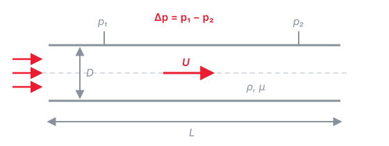

::: {.callout-note}
## About this page

This tutorial is a **checklist, not a lecture**. Everything here should be
familiar from your fluid mechanics and math courses — we will briefly
repeat some of it inside later exercises, but not re-teach it. Work
through the *self-checks* at the end of each section; if one feels hard,
review that topic before Tutorial 1 (references at the bottom).
:::

## Basic tensor algebra {#sec-tensors}

### What is a tensor?

A **tensor** is a physical quantity that exists independently of the
coordinate system used to describe it — only its *components* change when
the coordinate axes are rotated, and they do so in a well-defined way.
Tensors are classified by their **order** (or rank), which is simply the
number of indices needed to identify one component:

- **Order 0 — scalar** (1 component): temperature $T$, pressure $p$, density $\rho$.
- **Order 1 — vector** (3 components): velocity $u_i$, i.e. $(u_1, u_2, u_3)$.
- **Order 2** (9 components): stress $\sigma_{ij}$, velocity gradient $\partial u_i / \partial x_j$.

A second-order tensor is more than a matrix of numbers: it is a *linear
map between vectors*. The classic example is the Cauchy stress tensor,
which maps the unit normal $n_j$ of a surface to the traction (force per
area) $t_i$ acting on it:

$$
t_i = \sigma_{ij}\, n_j
$$ {#eq-cauchy}

We write tensors either in **symbolic (bold) notation** ($\mathbf{u}$,
$\boldsymbol{\sigma}$) or in **index notation** ($u_i$, $\sigma_{ij}$);
@sec-index explains the index rules in detail.

### Elementary operations

The operations you should recognize (in both notations):

$$
\mathbf{a} \cdot \mathbf{b} = a_i b_i, \qquad
(\mathbf{A}\mathbf{b})_i = A_{ij} b_j, \qquad
\mathbf{A} : \mathbf{B} = A_{ij} B_{ij}
$$ {#eq-ops}

i.e. the dot product (two vectors → scalar), the tensor–vector product
(→ vector, as in @eq-cauchy), and the double contraction (two tensors →
scalar, used later for the dissipation rate).

### Two special tensors: $\delta_{ij}$ and $\varepsilon_{ijk}$

The **Kronecker delta** is the index form of the identity:

$$
\delta_{ij} =
\begin{cases}
1 & i = j \\
0 & i \neq j
\end{cases}
$$ {#eq-kron}

Its key use is *index substitution*: multiplying by $\delta_{ij}$ and
summing renames an index, $\delta_{ij}\, a_j = a_i$.

The **Levi-Civita (permutation) symbol** $\varepsilon_{ijk}$ is the
third-order companion of @eq-kron:

$$
\varepsilon_{ijk} =
\begin{cases}
+1 & (i,j,k) \text{ an even permutation of } (1,2,3)\text{: } 123,\, 231,\, 312 \\
-1 & (i,j,k) \text{ an odd permutation: } 132,\, 213,\, 321 \\
0 & \text{any index repeated}
\end{cases}
$$ {#eq-levi}

It encodes cross products and hence rotation. The two expressions you
will meet in this course are the cross product and the **vorticity**:

$$
(\mathbf{a} \times \mathbf{b})_i = \varepsilon_{ijk}\, a_j b_k,
\qquad
\omega_i = \varepsilon_{ijk} \frac{\partial u_k}{\partial x_j}
$$ {#eq-cross}

Finally, the $\varepsilon$–$\delta$ identity connects the two symbols and
is the workhorse for simplifying double cross products:

$$
\varepsilon_{ijk}\, \varepsilon_{ilm} = \delta_{jl}\, \delta_{km} - \delta_{jm}\, \delta_{kl}
$$ {#eq-epsdelta}

### Symmetric / antisymmetric decomposition

Any second-order tensor splits uniquely into a symmetric and an
antisymmetric part:

$$
A_{ij} = \underbrace{\tfrac{1}{2}(A_{ij} + A_{ji})}_{\text{symmetric}}
       + \underbrace{\tfrac{1}{2}(A_{ij} - A_{ji})}_{\text{antisymmetric}}
$$ {#eq-decomp}

Applied to the velocity gradient this defines the **strain-rate tensor**
$S_{ij}$ (deformation) and the **rotation-rate tensor** $\Omega_{ij}$
(rigid-body rotation, related to $\omega_i$ from @eq-cross):

$$
\frac{\partial u_i}{\partial x_j} = S_{ij} + \Omega_{ij}, \qquad
S_{ij} = \frac{1}{2}\!\left(\frac{\partial u_i}{\partial x_j} + \frac{\partial u_j}{\partial x_i}\right), \qquad
\Omega_{ij} = \frac{1}{2}\!\left(\frac{\partial u_i}{\partial x_j} - \frac{\partial u_j}{\partial x_i}\right)
$$ {#eq-sij}

This decomposition appears in essentially every turbulence model.

::: {.callout-tip}
## Self-check — tensor algebra

1. What is $\delta_{ii}$? *(Careful: repeated index!)*
2. What are $\varepsilon_{123}$, $\varepsilon_{321}$, and $\varepsilon_{112}$?
3. Use @eq-cross to show $\mathbf{a} \times \mathbf{a} = \mathbf{0}$.

::: {.callout-note collapse="true" appearance="minimal"}
## Answers

1. $\delta_{ii} = \delta_{11}+\delta_{22}+\delta_{33} = 3$.
2. $\varepsilon_{123} = +1$, $\varepsilon_{321} = -1$, $\varepsilon_{112} = 0$.
3. $\varepsilon_{ijk} a_j a_k = 0$ because $a_j a_k$ is symmetric in
   $(j,k)$ while $\varepsilon_{ijk}$ is antisymmetric — swapping
   $j \leftrightarrow k$ flips the sign of the sum, so it must vanish.
:::
:::

## Continuity and Navier–Stokes {#sec-ns}

For an incompressible, Newtonian fluid with constant properties, the
governing variables and their SI units are:

| Symbol | Quantity | SI units |
|--------|----------|----------|
| $u_i$ | velocity | $\mathrm{m\,s^{-1}}$ |
| $p$ | pressure | $\mathrm{Pa} = \mathrm{kg\,m^{-1}\,s^{-2}}$ |
| $\rho$ | density | $\mathrm{kg\,m^{-3}}$ |
| $\mu$ | dynamic viscosity | $\mathrm{Pa\,s} = \mathrm{kg\,m^{-1}\,s^{-1}}$ |
| $\nu = \mu/\rho$ | kinematic viscosity | $\mathrm{m^2\,s^{-1}}$ |

**Continuity** (conservation of mass) states that the velocity field is
divergence-free; every term has units $\mathrm{s^{-1}}$:

$$
\nabla \cdot \mathbf{u} = 0
\qquad \left[\mathrm{s^{-1}}\right]
$$ {#eq-cont-vec}

**Momentum** (Navier–Stokes) is Newton's second law per unit mass; every
term has units of acceleration, $\mathrm{m\,s^{-2}}$:

$$
\underbrace{\frac{\partial \mathbf{u}}{\partial t}}_{\text{unsteady}}
+ \underbrace{(\mathbf{u} \cdot \nabla)\,\mathbf{u}}_{\text{convection}}
= \underbrace{-\frac{1}{\rho} \nabla p}_{\text{pressure gradient}}
+ \underbrace{\nu \nabla^2 \mathbf{u}}_{\text{viscous diffusion}}
\qquad \left[\mathrm{m\,s^{-2}}\right]
$$ {#eq-ns-vec}

Check the units term by term: $\partial \mathbf{u}/\partial t \sim
\mathrm{(m/s)/s}$; convection $\sim \mathrm{(m/s) \cdot (m/s)/m}$;
pressure gradient $\sim \mathrm{(Pa/m)/(kg/m^3)} =
\mathrm{kg\,m^{-2}\,s^{-2} \cdot m^3\,kg^{-1}}$; viscous term $\sim
\mathrm{(m^2/s) \cdot (m/s)/m^2}$ — all $\mathrm{m\,s^{-2}}$. ✓

Two things to remember: the **convective term is the only nonlinear
term** — it is the reason turbulence exists and the reason the averaged
equations don't close — and pressure in incompressible flow is not a
thermodynamic variable but a Lagrange multiplier that enforces @eq-cont-vec.

::: {.callout-tip}
## Self-check — governing equations

*(The index-notation tools for 1 and 2 are introduced in @sec-index — come
back here if needed.)*

1. Using continuity (@eq-cont-vec), show that the convective term can be
   written in **conservative form**:
   $u_j\, \partial u_i / \partial x_j = \partial (u_i u_j) / \partial x_j$.
2. Take the divergence of @eq-ns-vec and use continuity to show that
   pressure satisfies a **Poisson equation**,
   $\frac{1}{\rho} \frac{\partial^2 p}{\partial x_i \partial x_i}
   = -\frac{\partial u_j}{\partial x_i} \frac{\partial u_i}{\partial x_j}$.
   What does this tell you about the role of pressure in incompressible
   flow?
3. The viscous dissipation rate per unit mass is
   $\varepsilon = 2 \nu S_{ij} S_{ij}$ (with $S_{ij}$ from @eq-sij). Show
   that its units are $\mathrm{m^2\,s^{-3}} = \mathrm{W\,kg^{-1}}$.

::: {.callout-note collapse="true" appearance="minimal"}
## Answers

1. Product rule: $\partial (u_i u_j)/\partial x_j
   = u_j\, \partial u_i/\partial x_j + u_i\, \underbrace{\partial u_j / \partial x_j}_{=\,0}$
   — the last term vanishes by continuity. The conservative form is what
   finite-volume codes like OpenFOAM actually discretize.
2. Applying $\partial/\partial x_i$ to each term: the unsteady term gives
   $\partial(\partial u_i/\partial x_i)/\partial t = 0$ and the viscous
   term gives $\nu\, \partial^2 (\partial u_i / \partial x_i)/\partial x_j \partial x_j = 0$
   (both by continuity); the convective term leaves
   $\partial u_j/\partial x_i\; \partial u_i/\partial x_j$. Hence the
   Poisson equation. Pressure has **no evolution equation of its own**:
   it is determined instantaneously by the velocity field (elliptic
   problem) and acts as a Lagrange multiplier that enforces
   @eq-cont-vec — this is why incompressible solvers need a
   pressure-correction step (e.g. PISO/SIMPLE in OpenFOAM).
3. $[\nu] = \mathrm{m^2\,s^{-1}}$ and $[S_{ij}] = \mathrm{s^{-1}}$, so
   $[\varepsilon] = \mathrm{m^2\,s^{-1}} \cdot \mathrm{s^{-2}}
   = \mathrm{m^2\,s^{-3}}$. Since
   $\mathrm{W\,kg^{-1}} = \mathrm{J\,s^{-1}\,kg^{-1}}
   = \mathrm{kg\,m^2\,s^{-2}} \cdot \mathrm{s^{-1}\,kg^{-1}}
   = \mathrm{m^2\,s^{-3}}$, dissipation is a power per unit mass —
   kinetic energy converted to heat.
:::
:::

## Index notation {#sec-index}

We will write most turbulence equations in **Cartesian index (Einstein)
notation**. The rules:

1. A **repeated (dummy) index** in a term implies summation over 1–3:
   $a_i b_i = a_1 b_1 + a_2 b_2 + a_3 b_3$.
2. A **free index** (appearing once) must match in every term of an
   equation and denotes three equations at once.
3. No index may appear **more than twice** in a single term.

### Worked example 1: divergence of a vector

With the shorthand $\partial/\partial x_j$, the divergence
$\nabla \cdot \mathbf{u}$ has one repeated index $j$ — so it is a
scalar, written out as:

$$
\frac{\partial u_j}{\partial x_j}
= \frac{\partial u_1}{\partial x_1}
+ \frac{\partial u_2}{\partial x_2}
+ \frac{\partial u_3}{\partial x_3}
$$ {#eq-ex-div}

### Worked example 2: tensor–vector product

$b_i = A_{ij}\, x_j$ has free index $i$ and dummy index $j$: it is three
equations, each a sum of three terms. The first one ($i = 1$) reads

$$
b_1 = A_{11} x_1 + A_{12} x_2 + A_{13} x_3,
$$ {#eq-ex-matvec}

and analogously for $b_2$, $b_3$ — exactly a matrix–vector product.

### Navier–Stokes in index notation

Applying the same rules to @eq-cont-vec and @eq-ns-vec:

$$
\frac{\partial u_j}{\partial x_j} = 0
$$ {#eq-cont-idx}

$$
\frac{\partial u_i}{\partial t}
+ u_j \frac{\partial u_i}{\partial x_j}
= -\frac{1}{\rho} \frac{\partial p}{\partial x_i}
+ \nu \frac{\partial^2 u_i}{\partial x_j \partial x_j}
$$ {#eq-ns-idx}

Compare with @eq-ex-div and @eq-ex-matvec: continuity is a divergence
(one dummy index, scalar equation), while in @eq-ns-idx the free index
$i$ says "one equation per velocity component" and the dummy index $j$
sums the convective and viscous contributions from all three directions.
You should be able to translate between @eq-ns-vec and @eq-ns-idx
fluently — Reynolds averaging in the lectures happens almost entirely in
index notation.

::: {.callout-tip}
## Self-check — index notation

1. Write out the $i = 2$ component of the convective term
   $u_j\, \partial u_i / \partial x_j$.
2. Is that term linear in $\mathbf{u}$?
3. Is $c_i = a_j b_j d_i$ valid index notation? What about $c_i = a_j b_j d_j$?

::: {.callout-note collapse="true" appearance="minimal"}
## Answers

1. $u_1 \frac{\partial u_2}{\partial x_1} + u_2 \frac{\partial u_2}{\partial x_2} + u_3 \frac{\partial u_2}{\partial x_3}$.
2. No — velocity multiplies its own gradient (quadratic). This term
   generates the Reynolds stresses under averaging.
3. Valid ($j$ dummy, $i$ free); invalid — $j$ appears three times in one
   term.
:::
:::

## Dimensional analysis: the Reynolds number {#sec-dim}

Consider fully developed flow through a pipe (@fig-pipe): we ask how the
pressure drop $\Delta p$ over a length $L$ depends on the flow and fluid
parameters.

{#fig-pipe width="75%"}

The physical relationship is

$$
\Delta p = f(\rho,\ \mu,\ U,\ D,\ L),
$$ {#eq-pipe-rel}

with dimensions (using $\mathrm{M}$ = mass, $\mathrm{L}$ = length, $\mathrm{T}$ = time):

| Variable | $\Delta p$ | $\rho$ | $\mu$ | $U$ | $D$ | $L$ |
|----------|-----------|--------|-------|-----|-----|-----|
| Dimensions | $\mathrm{M\,L^{-1}\,T^{-2}}$ | $\mathrm{M\,L^{-3}}$ | $\mathrm{M\,L^{-1}\,T^{-1}}$ | $\mathrm{L\,T^{-1}}$ | $\mathrm{L}$ | $\mathrm{L}$ |

**Step 1 — count.** $n = 6$ variables, $k = 3$ independent dimensions
($\mathrm{M}, \mathrm{L}, \mathrm{T}$) ⟹ the Buckingham-$\Pi$ theorem
guarantees $n - k = 3$ independent dimensionless groups.

**Step 2 — choose repeating variables.** Pick $k = 3$ variables that
(i) together contain all three dimensions, (ii) are dimensionally
independent of each other, and (iii) do *not* include the dependent
variable $\Delta p$. The standard choice is $\rho$ (mass), $U$ (time),
$D$ (length).

**Step 3 — form the groups.** Each remaining variable, multiplied by
powers of the repeating ones, must come out dimensionless. For $\mu$:

$$
\Pi_2 = \mu\, \rho^{a} U^{b} D^{c}
\;\;\Rightarrow\;\;
\mathrm{M}^{1+a}\ \mathrm{L}^{-1-3a+b+c}\ \mathrm{T}^{-1-b} \overset{!}{=} \mathrm{M}^0 \mathrm{L}^0 \mathrm{T}^0
$$ {#eq-pi2-setup}

Setting each exponent to zero: $\mathrm{M}\!: a = -1$;
$\mathrm{T}\!: b = -1$; then $\mathrm{L}\!: c = -1$. Hence

$$
\Pi_2 = \frac{\mu}{\rho U D}
\quad\Longleftrightarrow\quad
\Pi_2^{-1} = \frac{\rho U D}{\mu} = \mathrm{Re}.
$$ {#eq-re}

The same procedure applied to $\Delta p$ and $L$ gives the other two
groups (do it yourself — self-check below):

$$
\Pi_1 = \frac{\Delta p}{\rho U^2}, \qquad
\Pi_3 = \frac{L}{D},
\qquad\text{so}\qquad
\frac{\Delta p}{\rho U^2} = \phi\!\left(\mathrm{Re},\ \frac{L}{D}\right)
$$ {#eq-pipe-result}

— six dimensional variables collapse to a relation between three
numbers. That is exactly why friction-factor charts (Moody diagram) work.

**The physical meaning of $\mathrm{Re}$** is the ratio of inertial to
viscous effects:

$$
\mathrm{Re} = \frac{\rho U D}{\mu} = \frac{U D}{\nu}
\sim \frac{\text{inertial forces}}{\text{viscous forces}}
$$ {#eq-re-meaning}

The same conclusion follows from non-dimensionalizing @eq-ns-idx with
$x_i^* = x_i / D$, $u_i^* = u_i / U$, $t^* = tU/D$, $p^* = p / (\rho U^2)$:

$$
\frac{\partial u_i^*}{\partial t^*}
+ u_j^* \frac{\partial u_i^*}{\partial x_j^*}
= -\frac{\partial p^*}{\partial x_i^*}
+ \frac{1}{\mathrm{Re}} \frac{\partial^2 u_i^*}{\partial x_j^* \partial x_j^*}
$$ {#eq-ns-nd}

$\mathrm{Re}$ is the only parameter left — two incompressible flows with
the same geometry and Reynolds number are dynamically similar, and the
viscous term becomes small (in a subtle, near-wall-dominated way) as
$\mathrm{Re} \to \infty$. This is the starting point of the course.

::: {.callout-tip}
## Self-check — dimensional analysis

1. Derive $\Pi_1$ in @eq-pipe-result by repeating Step 3 for $\Delta p$.
2. The pipe wall has a roughness height $k_s$ $[\mathrm{L}]$. Which
   dimensionless group does it add?
3. Water flows at $U = 1\,\mathrm{m\,s^{-1}}$ through a
   $D = 5\,\mathrm{cm}$ pipe ($\nu = 10^{-6}\,\mathrm{m^2\,s^{-1}}$).
   Compute $\mathrm{Re}$. Laminar or turbulent?

::: {.callout-note collapse="true" appearance="minimal"}
## Answers

1. $\Delta p\, \rho^a U^b D^c$: $\mathrm{M}\!: a=-1$; $\mathrm{T}\!: b=-2$;
   $\mathrm{L}\!: -1+3-2+c=0 \Rightarrow c=0$ — giving $\Delta p / (\rho U^2)$.
2. The relative roughness $k_s / D$ (the third parameter of the Moody
   diagram).
3. $\mathrm{Re} = UD/\nu = 5 \times 10^4$ — far above the transitional
   value $\approx 2300$: turbulent.
:::
:::

## Where to review

If any of the above is rusty: the fluid mechanics fundamentals
(@sec-tensors–@sec-ns) are covered in @kundu2015 (Chs. 2–4), tensor and
index notation in @pope2000 (Appendix A), and @tennekes1972 remains a
classic compact introduction to turbulence itself.

## References

::: {#refs}
:::
